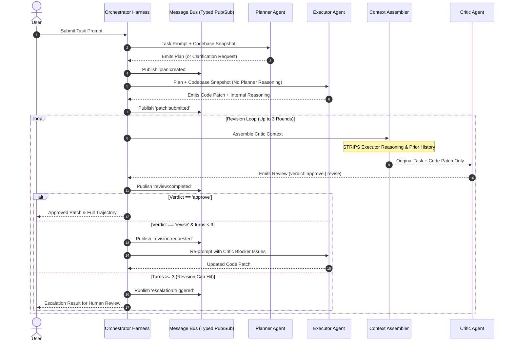

# Multi-Agent Orchestration & Trajectory Evaluation System

A TypeScript framework for orchestrating multi-agent LLM systems (**Planner**, **Executor**, **Critic**), enforcing strict context isolation boundaries, mitigating agent sycophancy, managing bounded revision loops with human escalation, and evaluating trajectory quality across quantitative benchmark metrics.

---

## 🌟 Key Features

- **🎭 Three Specialized Agents**:
  - **Planner**: Deconstructs user requirements into structured technical plans or asks clarifying questions on ambiguous tasks.
  - **Executor**: Generates code patches and records internal self-reasoning.
  - **Critic**: Independent reviewer using anti-sycophancy prompt framing to flag `blocker` vs `minor` severity issues.
- **🛡️ Strict Context Isolation**:
  - Strips Executor self-reasoning and prior conversation history from the Critic prompt context, eliminating context leakage (verified by context-assembler.test.ts). Config D (isolated) achieved the lowest per-task cost: 2,852 tokens / 28.2s.
- **🔄 Revision Loop & Escalation Engine**:
  - Manages iterative code revision loops. If revision cap (default 3 rounds) is reached without resolution, automatically triggers an EscalationResult for human review — capping the loop cut mean revision rounds (3.60 → 1.73) and per-task token spend by ~52% vs the unbounded config (5,879 → 2,852).
- **📊 15-Task Golden Benchmark Suite**:
  - Includes 10 well-specified tasks targeting the Task 3 repository codebase (`Task-3_Agent_Loop_Mcp`), 3 seeded flaw tasks, and 2 ambiguous tasks.
- **📈 6 Quantitative Trajectory Evaluation Metrics**:
  1. `task_success_rate`
  2. `critic_catch_rate` (on seeded flaws)
  3. `rubber_stamp_rate` (sycophancy disagreement analysis)
  4. `mean_revision_rounds`
  5. `redundant_round_trip_ratio`
  6. `total_tokens_per_task` & `wall_clock_per_task`
- **🤖 Native Local Ollama Integration**:
  - Directly connects to local Ollama instance (`qwen2.5:7b-instruct`) via HTTP endpoint with zero external API key requirements.

---

## 🏗️ Architecture & Communication Flow



---

## 📁 Project Structure

```
multi-agent-orchestrator/
├── pnpm-workspace.yaml
├── package.json
├── packages/
│   └── orchestrator/
│       ├── package.json
│       ├── tsconfig.json
│       ├── vitest.config.ts
│       ├── src/
│       │   ├── types/
│       │   │   └── messages.ts          # Zod schemas & TypeScript contracts
│       │   ├── bus/
│       │   │   ├── message-bus.ts       # Typed in-memory event bus
│       │   │   └── bus.test.ts
│       │   ├── agents/
│       │   │   ├── planner.ts           # Planner Agent prompt & logic
│       │   │   ├── executor.ts          # Executor Agent prompt & logic
│       │   │   ├── critic.ts            # Critic Agent anti-sycophancy prompt & severity logic
│       │   │   └── agent.test.ts
│       │   ├── harness/
│       │   │   ├── orchestrator.ts      # Main orchestration engine & revision loop logic
│       │   │   ├── context-assembler.ts # Strict context boundary isolator & repo snapshot reader
│       │   │   ├── llm-client.ts        # Ollama local HTTP API client & JSON repair parser
│       │   │   └── harness.test.ts
│       │   ├── cli/
│       │   │   └── index.ts             # CLI application (`orch run`, `orch run-all`, `orch eval`)
│       │   └── index.ts
│       └── tests/
│           └── fixtures/
│               └── test-repo/           # Real project fixture cloned from Task 3 repository
├── evals/
│   ├── golden-orchestrator.jsonl        # 15 benchmark golden tasks
│   └── metrics.ts                       # Metric computation engine
├── docs/
│   ├── DESIGN.md                        # System specification & interface definitions
│   ├── RESULTS.md                       # Comparative benchmark evaluation results
│   └── NOTES.md                         # Failure mode deep-dive (sycophancy, confabulation, leakage)
└── results/                             # Trajectories JSON and comparison benchmark output
```

---

## ⚡ Getting Started & CLI Usage

### Prerequisites
- **Node.js**: `v20.0.0` or higher
- **pnpm**: `v8.0.0` or higher
- **Ollama** (Local LLM Provider):
  ```bash
  ollama run qwen2.5:7b-instruct
  ```

### Installation

```bash
# Clone or navigate into project directory
cd multi-agent-orchestrator

# Install dependencies
pnpm install
```

### CLI Commands

```bash
# 1. Run unit & integration test suite (14 passing tests)
pnpm test

# 2. Run a task targeting the Task 3 repository codebase (Live Ollama)
pnpm orch run --task "Add rate limiting to MCP server tool invocations in packages/agent/src/mcp/server.ts"

# For silent output (hiding pnpm script headers):
pnpm -s orch run --task "Add rate limiting to MCP server tool invocations in packages/agent/src/mcp/server.ts"

# 3. Execute the 15 golden tasks benchmark across Configs A, B, C, D
pnpm orch run-all --golden

# 4. Compute evaluation metrics and generate docs/RESULTS.md
pnpm orch eval

# 5. Evaluate and compare against a baseline metrics JSON file
pnpm orch eval --compare baseline.json
```

---

## 🧪 Benchmark Evaluation Results

| Metric | Single-Agent (A) | Critic No Cap (B) | Critic 3-Cap (C) | Critic Isolated (D) |
| :--- | :---: | :---: | :---: | :---: |
| **Task Success Rate** | 100% (`1.0`) | 86.7% (`0.867`) | 46.7% (`0.467`) | 66.7% (`0.667`) |
| **Critic Catch Rate** | N/A | 100% (`1.0`) | 100% (`1.0`) | 100% (`1.0`) |
| **Rubber-Stamp Rate** | N/A | 0% (`0.0`) | 0% (`0.0`) | 0% (`0.0`) |
| **Mean Revision Rounds** | 1.00 | 3.60 | 2.27 | 1.73 |
| **Tokens / Task** | 1,556 | 5,879 | 3,855 | 2,852 |
| **Wall-Clock / Task** | 17.8s | 69.7s | 38.8s | 28.2s |

---

## 📜 License

Distributed under the ISC License.
